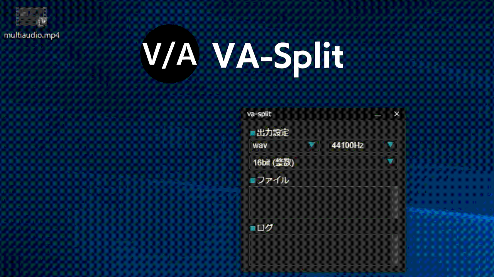

# va-split


動画ファイルを動画と音声に分割したり、変換したりします。

---

## ダウンロード
[va-split.zip](https://github.com/gomihitosi/va-split/releases/download/release/va-split.zip)

## 使い方
* ffmpeg.exe を用意
* va-split.exe を起動
  * 起動出来なかった場合は install.msi を実行してインストール、起動
* va-split に ffmpeg.exe をドラッグアンドドロップ
* va-split に動画ファイルをドラッグアンドドロップ
  * 無音の動画ファイルと、トラック数分の音声ファイルが出力される

## ffmpeg.exe について
* 下記 URL の Assets にある ffmpeg-master-latest-win64-gpl.zip をダウンロードして解凍してください。
解凍されたフォルダの bin フォルダ内に ffmpeg.exe があります。
https://github.com/BtbN/FFmpeg-Builds/releases

## クレジット
* OtoLogic様 (オノマトペ アクセント41): https://otologic.jp

---

## 開発用TODO
* Jest, Eslint, Prettier の導入

## 開発用メモ
```
### 開発モードで実行
npm run tauri dev

### src-tauri/target/release にビルド
npm run tauri build

### src-tauri/icons に app-icon.png を変換して出力
npm run tauri icon
```